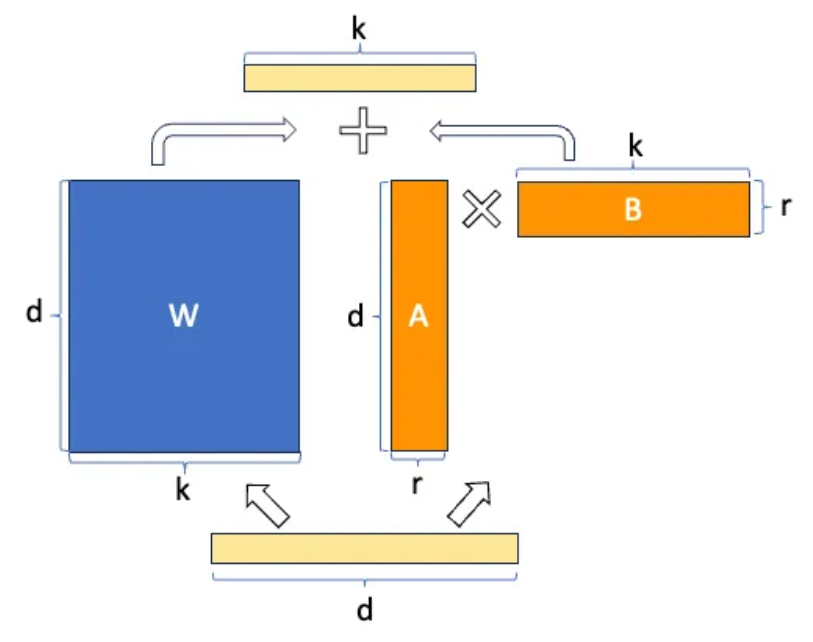
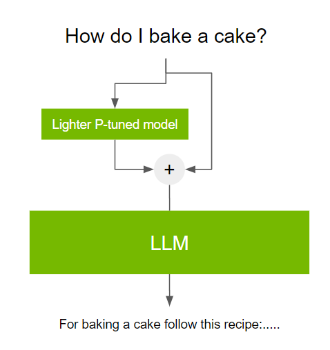

Large Language Models (LLMs) have revolutionized how we interact with computers. These complex models can understand and generate human language, making them ideal for tasks like machine translation, writing creative content, and building chatbots. However, training LLMs requires huge amounts of data and compute power to train effectively.

## Pre-training: Building a Strong Foundation

Imagine a child learning a language. They are exposed to vast amounts of text through reading, listening, and conversation. This exposure allows them to develop a fundamental understanding of language, grammar, vocabulary, and sentence structure. Similarly, pre-training exposes LLMs to massive datasets of text. These datasets can come from books, articles, code repositories over the internet, and even online conversations.

Here’s the key: pre-training utilizes self-supervised learning. This means the model learns by itself, identifying patterns and relationships within the data.

Common pre-training tasks include predicting the next word in a sequence or identifying masked words. Through these exercises, the LLM develops a powerful internal representation of language — a kind of mental map that allows it to understand the nuances of human communication.

## Fine-tuning: Sharpening the Skills

While pre-training provides a strong foundation, it doesn’t make the LLM an expert in a specific domain. This is where fine-tuning steps in. It’s like taking that child with a strong language foundation and enrolling them in a specialized program, say, learning French. Fine-tuning involves taking a pre-trained LLM and adjusting its parameters to excel at a specific task.

### Approaches to Fine-Tuning

### Full Fine-tuning

Full fine-tuning is the process of training the entire model on a dataset related to a specific task.

For example, to build a finance chatbot, you would fine-tune the LLM on a massive dataset of financial news, reports, and conversations.

While effective, full fine-tuning has a major drawback — it can lead to catastrophic forgetting. As the model focuses on the new task, it may lose its proficiency in the skills it learned during pre-training.

## Beyond Full Fine-tuning: Addressing Catastrophic Forgetting

Full fine-tuning often leads to catastrophic forgetting where fine-tuning a model degrades its weights for other tasks that the model was pretrained for.

### How to Avoid Catastrophic Forgetting

### Multitask Instruction Fine-tuning

This approach involves fine-tuning the LLM on multiple tasks simultaneously. By exposing the model to a broader range of tasks, it can learn to generalize better.

### Parameter-Efficient Fine-tuning (PEFT)

These methods focus on updating a smaller subset of parameters within the LLM. This reduces the computational cost and memory requirements compared to full fine-tuning. Additionally, PEFT methods are less prone to catastrophic forgetting.

### Parameter-Efficient Fine-tuning (PEFT) Methods

### Selective Fine-tuning

This involves freezing most of the LLM’s weights and focusing on training only specific layers or components. This allows for targeted improvement while preserving the pre-trained knowledge.

### Reparameterization

This method utilizes techniques like LoRA (Low-Rank Adaptation) to reduce the number of trainable parameters significantly. LoRA injects smaller matrices alongside the original weights, effectively compressing the information needed for fine-tuning.

### LoRA: A Powerful Ally in PEFT

LoRA, or Low-Rank Adaptation, is a groundbreaking technique within PEFT. LoRA reduces the number of trainable parameters to be trained by freezing most of the original LLM weights. It injects two rank-decomposed matrices alongside original weights. Dimensions of these matrices are set so that their product is the same dimension as the weights they are modifying.

For example: A base transformer model has weights of dimension 512 * 512, which results in 262,144 trainable parameters. Instead of training all the parameters, we inject two rank-decomposed matrices ‘A’ and ‘B’ of rank = 8. This makes A and B of dimensions = 8 * 512 and 512 * 8, respectively, totaling 8,192 parameters. This gives us up to a 97% reduction in parameters.

- **Reduced Memory Footprint:** LoRA requires less memory to store the model weights, making it ideal for deployment on resource-constrained devices.
- **Faster Training and Adaptation:** With fewer parameters to fine-tune, LoRA significantly accelerates the training process. This allows for quicker adaptation of the LLM to new tasks.

## Prompt Tuning and Soft Prompts: An Additive Approach

Prompt tuning is an additive method within PEFT that improves models’ performance without changing model weights at all. It is different from prompt engineering as prompt engineering deals with working on prompt language to get the desired completion from the model.

Prompt tuning involves using a small trainable model before using the LLM itself. This small model is trained to add task-specific tokens or soft prompts on top of the input text. The optimal values for these tokens are learned through supervised learning over time. The process of soft prompting is a black box as we cannot interpret embeddings added by the model on top of the input text.

The beauty of this approach lies in its flexibility — the same LLM can be fine-tuned for various tasks by simply switching the prompts.

Prompt-tuned models are lightweight, making this method highly efficient and flexible.

## Conclusion

Parameter-efficient fine-tuning methods pave the way for even more powerful LLMs. These models are adapting to new tasks quickly and efficiently, making them invaluable tools across various industries. As research progresses, we can expect further refinements in fine-tuning techniques, allowing us to unlock the full potential of language and empower LLMs to become even more versatile collaborators.
